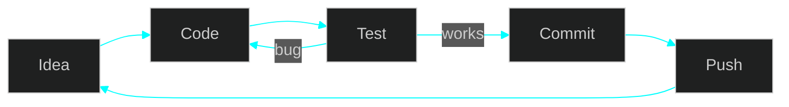

<div align="center">


<a href="https://github.com/soumadip420">
  
</a>

<br/>


</div>

<br/>

## `$ cat about.md`

<table>
<tr>
<td width="50%" valign="top">

```yaml
user:      soumadip420
role:      Computer Engineering Student
location:  West Bengal, India
focus:     Learning & building projects
goal:      Become a strong software engineer
```

</td>
<td width="50%" valign="top">

```text
┌─ quick facts ──────────────┐
│ > builds things for fun    │
│ > debugs until it works    │
│ > always learning          │
│ > open to collaboration    │
└────────────────────────────┘
```

</td>
</tr>
</table>

<br/>

## `$ ls ~/skills`

<div align="center">


</div>

| Skill | Level | Progress |
|:------|:------|:---------|
| Python | Learning | `████████░░` 80% |
| JavaScript | Learning | `██████░░░░` 60% |
| HTML / CSS | Comfortable | `█████████░` 90% |
| Git / GitHub | Learning | `███████░░░` 70% |

> Edit the levels above to match what you really know. Delete or add rows freely.

<br/>

## `$ tree ~/workspace/projects`

| # | Project | Stack | Progress | Status |
|:-:|:--------|:------|:---------|:------:|
| 01 | **project-one** | Python | `████████░░` 80% | 🟢 active |
| 02 | **project-two** | JavaScript | `██████░░░░` 60% | 🟢 active |
| 03 | **project-three** | HTML · CSS | `████░░░░░░` 40% | 🟡 wip |

```bash
$ make projects
[ 33%] Building project-one ........ done
[ 66%] Building project-two ........ done
[100%] Building project-three ...... done
```

<!--
Replace REPO_ONE / REPO_TWO with real repo names and remove the comment markers
to show live pinned-repo cards.

<a href="https://github.com/soumadip420/REPO_ONE"></a>
<a href="https://github.com/soumadip420/REPO_TWO"></a>
-->

[`$ cd ~/repositories`](https://github.com/soumadip420?tab=repositories)

<br/>

## `$ git log --graph` &nbsp;(my workflow)



<br/>

## `$ cat ~/.roadmap`

```diff
+ [x] Programming fundamentals
+ [x] HTML, CSS and JavaScript basics
! [~] Python projects
! [~] Data structures & algorithms
- [ ] Bigger full-stack project
- [ ] Open source contribution
```

<br/>

## `$ git stats`

<div align="center">


</div>

<br/>

## `$ ./contact.sh`

<div align="center">

<a href="https://github.com/soumadip420"></a>
<a href="https://www.linkedin.com/in/your-id"></a>
<a href="mailto:your@email.com"></a>

<br/><br/>

```bash
$ echo "open to collaboration and internships"
$ exit 0
```


</div>
